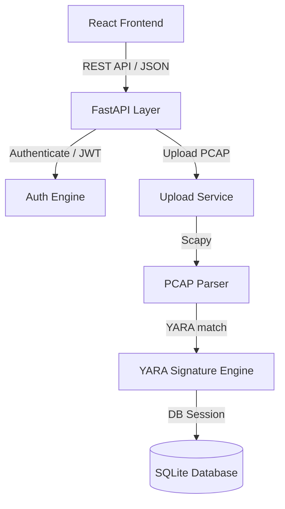

# Cerberus-Hash 🛡️

A web-based PCAP analyzer that detects malicious network traffic using YARA rules and MD5 hash matching.

## 🎯 Features

- Upload and analyze `.pcap`/`.pcapng` files
- Extract MD5 hashes from packet payloads
- YARA-based malware detection with 200+ signatures
- Interactive web dashboard with scan statistics

## 🏗️ Project Structure

```
Cerberus-Hash/
├── backend/              # FastAPI backend app
├── frontend/             # React JS frontend app (Vite)
├── requirements.txt      # Python dependencies
├── uploads/              # Uploaded PCAP files
└── yara_rules/          # Malware detection rules
```

## 🏗️ Architecture Overview

The system processes and inspects traffic in an isolated pipelines structure:



### Key Components
- **API Layer (FastAPI):** Controls routing, workspace environments, session context, and detail reports.
- **Parser (Scapy):** Decodes network captures and computes payload MD5 checks.
- **Scanner (YARA):** Matches payload signatures dynamically against YARA rules.
- **Isolation Boundary (Workspaces):** Keeps individual investigations fully separated.

## 🚀 Quick Start

### 1. Run the FastAPI Backend
```bash
cd backend
pip install -r requirements.txt
uvicorn app.main:app --reload
```
The API will be available at: `http://localhost:8000`

### 2. Run the React JS Frontend
```bash
cd frontend
npm install
npm run dev
```
Access the application at: `http://localhost:5173`

**Dependencies:** FastAPI, React (Vite), TailwindCSS, Scapy, YARA-Python

## 🎮 Usage

1. Upload a PCAP file via the web interface
2. System extracts packets and generates MD5 hashes
3. Scans hashes against YARA malware rules
4. View detailed results and statistics

## 🔍 How It Works

1. **Packet Extraction** - Scapy parses PCAP files
2. **Hash Generation** - MD5 hashes computed for payloads  
3. **Signature Matching** - Hashes compared against YARA rules
4. **Result Display** - Bootstrap web interface shows detections

## 🛠️ Customization

Add custom YARA rules to `yara_rules/malware_rules.yar` for new threat patterns.

## 👨‍💻 Author

**PRADEESH L** - [@pradeeshl](https://github.com/pradeeshl)

## ⚠️ Disclaimer

For cybersecurity research purposes. Analyze PCAP files in isolated environments and comply with applicable laws.

---
*Cerberus-Hash - Network threat detection through packet analysis* 🛡️
