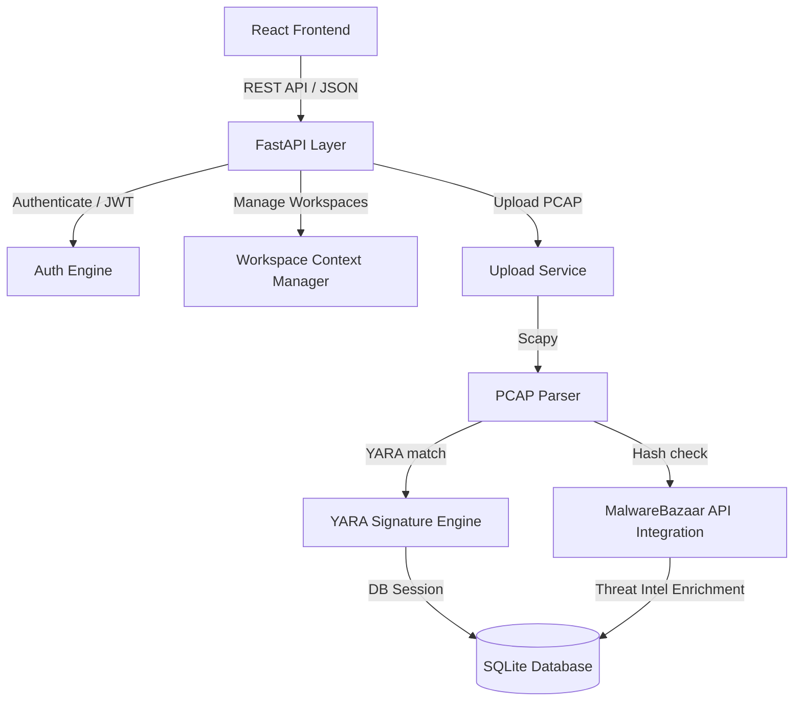

# Cerberus-Hash 🛡️

Cerberus-Hash is a state-of-the-art, cyberpunk-themed threat intelligence and network packet investigation platform. Combining the power of a **FastAPI backend** with a **React-Vite frontend**, it enables security researchers and threat hunters to dissect `.pcap`/`.pcapng` network captures, extract malicious payloads, and run multi-stage threat detection.

Through dual-engine matching—local signature queries using compiled **YARA rules** and real-time remote intelligence lookups via the **abuse.ch MalwareBazaar API**—Cerberus-Hash bridges the gap between raw network forensic captures and immediate incident enrichment.

---

## 🎯 Key Features

### 1. Isolated Investigation Workspaces 📁
- **Workspace Isolation:** Analysts can segment investigations by environment, team, or incident number.
- **Dynamic Switcher:** Hot-swap between workspaces from the dashboard header.
- **Workspace Modal Management:** Create, delete, and view metadata for individual investigation boundaries.

### 2. Deep Packet Payload Analysis 🔍
- **PCAP/PCAPNG Decoding:** Decodes capture files using Scapy to reconstruct payload data.
- **Automated Hash Computation:** Generates MD5 hash footprints for every payload to pinpoint known malware files.
- **Interactive Scan Reports:** View timelines, threat severities, and payload bytes directly in a cyberpunk UI.

### 3. Dual Detection Engine 🚀
- **Local YARA Engine:** Uses `yara-python` compiled rule matching to scan hashes against known threat families.
- **Resilient Fallback Scanner:** Automatically falls back to a custom pure-Python regex-based signature match if `yara-python` is not compiled or installed.
- **MalwareBazaar API Enrichment:** Queries the abuse.ch MalwareBazaar database in real-time to enrich alert reports with official malware signatures, tags, and reporter aliases.

### 4. Security & Analyst Profiles 👤
- **JWT Session Protection:** Secure sign-up/login authentication backed by SQLite store.
- **Analyst Designations:** Choose roles such as *Cyber Analyst*, *Threat Hunter*, *Core Operator*, or *Forensic Lead*.
- **Control Preferences:** Customize your experience by toggling email alerts, desktop notifications, and database auto-cleanup rules.

---

## 🏗️ Architecture Overview

The platform uses a modular pipeline where individual investigations are isolated by workspace contexts:



---

## 🏗️ Project Structure

```
Cerberus-Hash/
├── backend/                  # FastAPI Backend Application
│   ├── app/
│   │   ├── api/             # API Endpoints (Auth, Workspaces, Scans)
│   │   ├── core/            # Config, YARA engine, MalwareBazaar client
│   │   ├── models/          # SQLAlchemy Database Models
│   │   ├── schemas/         # Pydantic Schemas
│   │   ├── services/        # Business Logic & Scapy PCAP parsing
│   │   └── main.py          # FastAPI Entry Point
│   ├── requirements.txt      # Python Dependencies (FastAPI, Scapy, yara-python)
│   └── cerberus_hash.db      # Local SQLite Database (auto-generated)
├── frontend/                 # React Frontend Application (Vite + Tailwind CSS)
│   ├── src/
│   │   ├── components/      # UI Elements (Sidebar, Workspace Switcher, etc.)
│   │   ├── features/        # Feature Views (Dashboard, Profile, Scans, Auth)
│   │   ├── api.js           # API Client Service & Headers
│   │   ├── App.jsx          # Main Router & Theme Wrapper
│   │   └── index.css        # Tailwind CSS & Cyberpunk Gradients
├── uploads/                  # Storage directory for uploaded PCAPs
└── yara_rules/              # Signature storage directory
    └── malware_rules.yar    # Core YARA malware definition files
```

---

## ⚙️ Configuration & Environment Variables

Copy `.env.example` in the project root to `.env` to customize settings:

```env
# JWT and Authentication Settings
SECRET_KEY=your-custom-secure-secret-key-here
JWT_ALGORITHM=HS256
ACCESS_TOKEN_EXPIRE_MINUTES=60

# Database Configuration (Defaults to SQLite)
DATABASE_URL=sqlite:///backend/cerberus_hash.db

# Workspace Directories
UPLOAD_DIR=uploads
YARA_RULES_PATH=yara_rules/malware_rules.yar

# Threat Intelligence APIs (Optional)
MALWAREBAZAAR_API_KEY=your_abuse_ch_malwarebazaar_api_key_here
```

---

## 🚀 Quick Start

### Prerequisites
- Python 3.10+
- Node.js 18+ & npm

### 1. Setup the FastAPI Backend
```bash
# Navigate to the backend directory
cd backend

# Create a virtual environment
python -m venv venv
source venv/bin/activate  # On Windows: venv\Scripts\activate

# Install dependencies
pip install -r requirements.txt

# Start the uvicorn development server
uvicorn app.main:app --reload
```
The FastAPI server will start on **`http://localhost:8000`** (Swagger docs available at `/docs`).

### 2. Setup the React Frontend
```bash
# Navigate to the frontend directory
cd frontend

# Install Node modules
npm install

# Start the Vite local server
npm run dev
```
The client app will launch at **`http://localhost:5173`**.

---

## 🎮 Threat Hunting Workflow

1. **Accessing the Workspace**: Authenticate via the custom login page or provision a new analyst account.
2. **Targeting a Workspace**: Initialize an investigation workspace or select one from the switcher list.
3. **Uploading PCAP Capture**: Drag-and-drop or select a network capture file under the Workspace view.
4. **Analyzing Detections**:
   - The backend parses the PCAP, hashes payload content, runs the YARA match rule, and queries MalwareBazaar.
   - Detections populate a real-time table highlighting the packet index, malicious MD5, rule match source, tag metadata, severity profile, and the raw payload segment.
5. **Configuring Preferences**: Update your analyst avatar, role, and alerts directly via the Profile console.

---

## 🛡️ YARA Configuration

Add custom threat signatures directly into `yara_rules/malware_rules.yar`. Below is an example structure:

```yara
rule Cerberus_Malware_Match {
    meta:
        description = "Identifies target threat hash signatures within TCP payloads"
        author = "Cerberus Forensic Lab"
        severity = "high"
        vt_positives = 45
    strings:
        $h1 = "44d88612fea8a8f36de82e1278abb02f"
    condition:
        any of them
}
```

---

## 👨‍💻 Author

**PRADEESH L** - [@pradeeshl](https://github.com/pradeeshl)

---

## ⚠️ Disclaimer

This utility is intended strictly for authorized security research and malware analysis purposes. Always execute PCAP uploads and threat intelligence testing within sandbox parameters or isolated networks. The author is not responsible for misuse or violations of local privacy laws.

